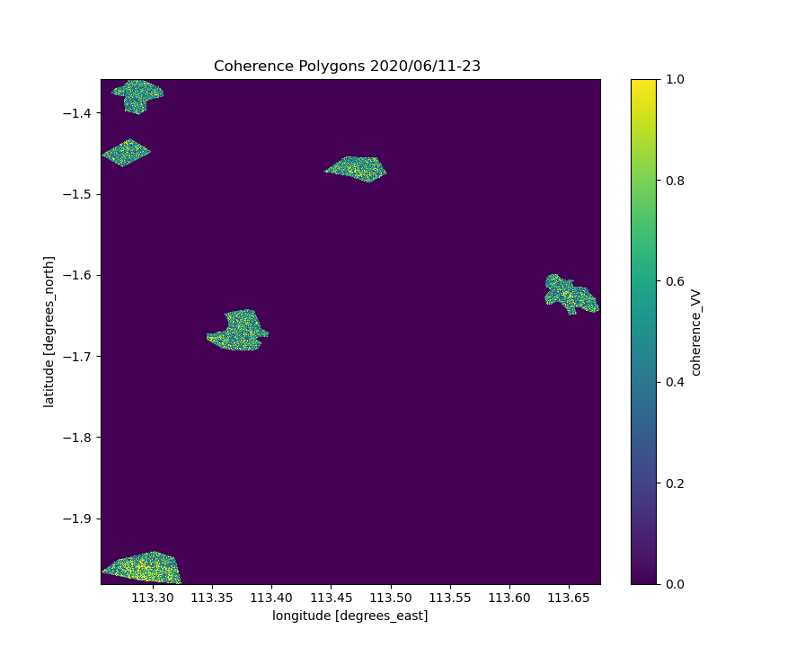
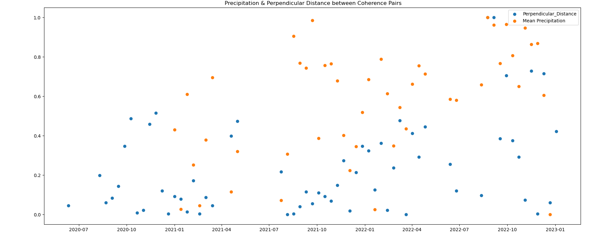
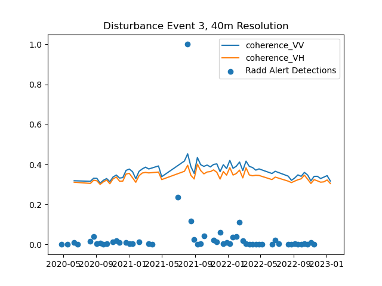
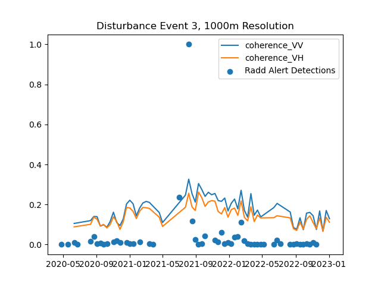
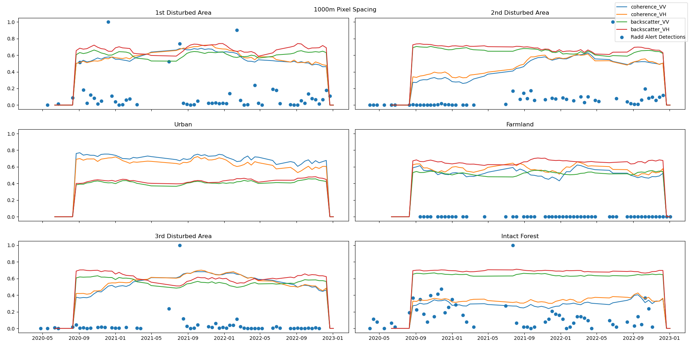

# Sentinel-1-Coherence-Pipeline
MSc Sentinel-1 Coherence Processing &amp; Analysis pipeline, using Snappy, Rasterio &amp; Xarray.

<!-- ABOUT THE PROJECT -->
## About The Project
<!-- 
Coherence remains an underdeveloped InSAR product when it comes to forest monitoring applications.
Plenty of examples of the use of backscatter in production can be found, see the Global Forest Watch initiative.  
However, there lacks an implementation of coherence in these already existing backscatter monitoring systems.
Coherence can be an affective supplimental data source for backscatter based systems. 

Here, I present a pipeline for processing Sentinel-1 SLC data to produce Xarray data-cubes containing both coherence and 
backscatter time series. 
-->

## Contents

#### Thesis Proposal: 
Original proposal for this thesis, which outlines the goals, objectives, and methodology of the research.

##### SNAPPY_interface: 
Python module contained in src/sentinel1slc.py that provides functions that interface to the Sentinel-1 preprocessing tools provided by the SNAP software.  uses the SNAPPY interface to perform preprocessing.  

#### Coherence_and_backscatter_processing: 
bin/seninel1slc_bsc_coh_preprocessing.py contains a script for processing SLC and ASF SBAS pairs to generate coherence and backscatter data. 

#### Xarray_data_cube_production: 
src/coherence_time_series.py contains a Python class that provides functionality for combining polarisations and varying window sizes to generate Xarray data cubes from the coherence and backscatter data generated in the previous step. This class includes a range of methods for manipulating and visualising the data.

#### Data_analysis: 
The bin/coherence_time_series_analysis.py script provides interface examples to the CoherenceTimeSeries class used
to performs data analysis and to generate final data products.

#### Utils: 
This directory contains works in progress and a range of utility functions. These include functions for animating a coherence stack, calculating coherence change and coherence change detection.  

## Introduction:
# Study Area:

This study focuses on the Central Kalimantan region of Indonesia on the island of Borneo, which is known for its extensive logging activities. The study area consists of a number of SAR acquisition tiles and was selected using the Global Forest Watch platform due to its clear-cut forested areas, which were detected by the RADD layer of the integrated deforestation alert system. The study examines specific events that occurred between February 2021 and March 2022, which are of particular interest.

  
  

example acquisition over Borneo.

# Methods

The methodology of this study consists of three main steps. Firstly, SAR images were pre-processed using the Sentinel-1 Toolbox and Python packages such as Snappy. The pre-processing involved steps such as co-registration, calibration and  terrain correction. Secondly, coherence images were generated from the pre-processed SAR images using the SNAP software. Finally, coherence time series were analyzed using custom Python scripts and packages such as Rasterio and Xarray. The analysis involves identifying areas of change and assessing the suitability of coherence measures for mapping forest disturbances in the study area.

### Analysis:

## Research Question 1: 
# Building a Scalable Coherence Pipeline:

Things that affect coherence estimates:
precipetation,
perpendicular distance, 
coherence window size - closer to an infinite look spatial average the better - 

  

    
    
  

Example 12-day InSAR coherence acquisitions, for 20210501_20210513 and 20210724_20210805 repectively. Regular coherence and backscatter aquisitions over three years are stacked into rasterio stacks before being combined into Xarray data-cubes for final analysis. 

  

Example coherence polygons over region.

All figures below represent a percentage of the highest value for the time-period.

  

Perpendicular distances between acquisitions and precipitation over subject area. 
Precipitation is averaged over the number of days between coherence acquisitions.

The concept of coherence is central to this thesis, so it's determination was thoroughly researched. 
Coherence is determined by a spatial averaging window, where the true coherence is determined over a sum of infinite looks. 
In reality this is not possible, so the estimation of coherence contains bias from a number of sources. This bias decreases with increasing number of looks.   

$$γ̃ = γ e^{iΔφ} = \frac{\sum\limits_{N}E(S_1S_2^*)}{\sqrt{\sum\limits_{N}E(|S_1|^2)\sum\limits_{N}E(|S_2|^2)}}$$

As you increase th window size sued to calculate coherence, you decrease the bias associated with calculating it. This comes from the following equation: 

$$`γ̃  = γ_{snr}\tilde{\gamma}_{sys}\tilde{\gamma}_{sp}\tilde{\gamma}_{temp}`$$

  

    
      
    
  

Coherence estimates decrease as the window size increases. This affect is introduced due to the ratio of the bias to the coherence signal.  

## Research Question 2:
# Coherence Time-Series Analysis:

For my analysis,. show the time series of the change in coherence anmd backscattter, and talk about my results so far with them..
I also want to add the original coherence and bsc values possibly on top of the results? I feel like this will be too much information for the README... Posbbly for the readme I just stick to the boxcar plots.

In the plots above, we can see 3 confirmed forest disturbance events, with three reference areas with more consistent coherence and backscatter. 

These plots clearly show the decrease of backscatter and a significant increase in coherence when a large disturbance event occurs. 
The number of RADD-Alert Events is defined as the ratio between the number of events of the current day and the maximum number of events of any observed day.
Some notable events include:
Clear detection of disturbance events in the 3 disturbed areas,
higher sensitivity of coherence vs backscatter, (particularly observed in the 2nd disturbance event, where coherence rises from 25% to ~ 60% of its maximum value)
Consistent signals for both Urban and Intact Forest, showing that both coherence and backscatter are stable for the observations,
while farmland has a change in backscatter, presumably due to to reaping of the harvest, no forest disturbance events are detected.

To-Do:
some "simple" modelling...
