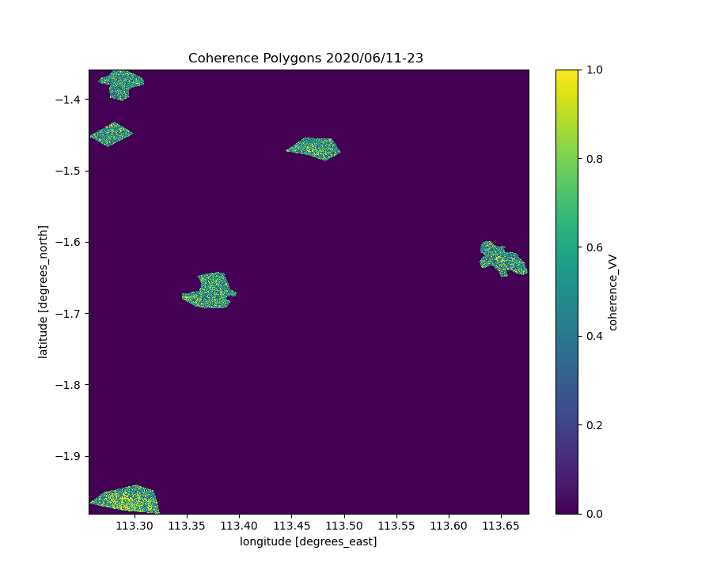
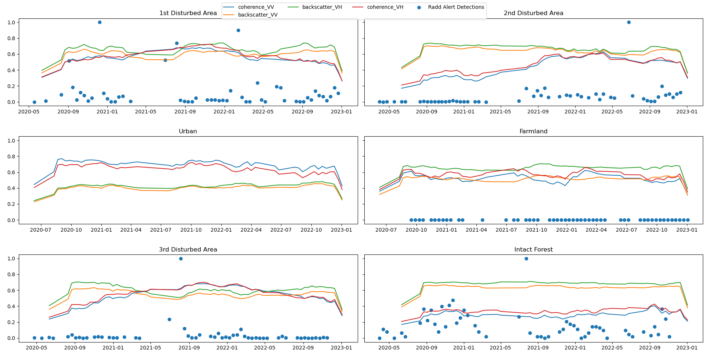
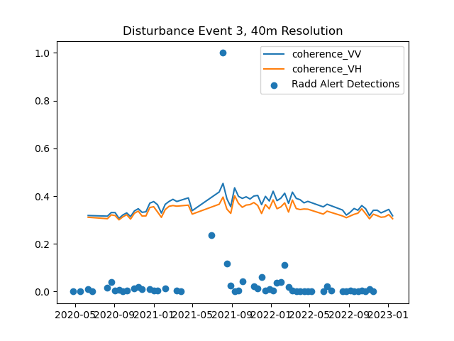
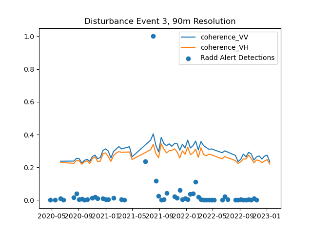
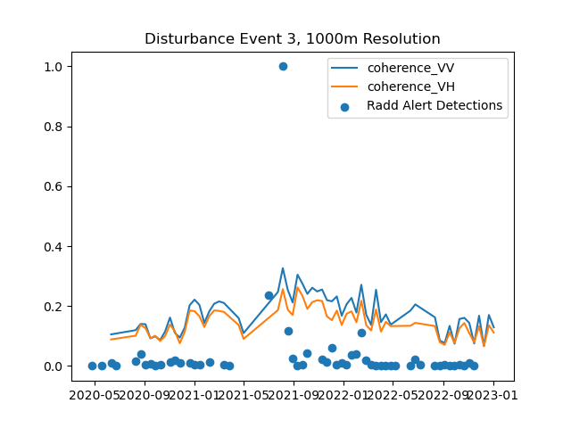

# Sentinel-1-Coherence-Pipeline
MSc Sentinel-1 Coherence Processing &amp; Analysis pipeline, using Snappy, Rasterio &amp; Xarray.

<!-- ABOUT THE PROJECT -->
## About The Project
<!-- 
Coherence remains an underdeveloped InSAR product when it comes to forest monitoring applications.
Plenty of examples of the use of backscatter in production can be found, see the Global Forest Watch initiative.  
However, there lacks an implementation of coherence in these already existing backscatter monitoring systems.
Coherence can be an affective supplimental data source for backscatter based systems. 

Here, I present a pipeline for processing Sentinel-1 SLC data to produce Xarray data-cubes containing both coherence and 
backscatter time series. 
-->

### Contents:
Thesis Proposal,\
Interface to Sentinel-1 preprocessing through SNAPPY,\
Coherence and backscatter processing from SLC & ASF SBAS Pairs,\
Functions for Xarray data-cube production, combining polarisations and varying window sizes,\
Coherence change detection based on Mintpy: https://github.com/insarlab/MintPy-tutorial/blob/main/applications/coherence_change_detection.ipynb

### Utility:
Produce animation of tiff stack.\
calculate coherence change over time and plot coherence change detection.\

### Pipeline creation:
Pipeline creation with Snappy. 

Methods:

example acquisition over Borneo.

  

Example 12-day InSAR coherence acquisitions,

  

    
    
  

Example polygons over region:

  

Here, insert a few images to compare two areas for a range of coherence windows, al;so imput my precipiation and perp distance measures..

All figures below represent a percentage of the highest value for the time-period.

Perpendicular distances between acquisitions and precipitation over subject area. 
Precipitation is averaged over the number of days between coherence acquisitions.
The perpendicular 

  

### Analysis:
Time series analysis of coherece and backscatter change.

For my analysis,. show the time series of the change in coherence anmd backscattter, and talk about my results so far with them..
I also want to add the original coherence and bsc values possibly on top of the results? I feel like this will be too much information for the README... Posbbly for the readme I jsut stick to the boxcar plots.

I want to add a comparison of 500 and 45 coherence look to show the affect of bias in my images for one area,  
As you increase th window size sued to calculate coherence, you decrease the bias associated with calculating it. This comes from the following equation: 

  

    
      
    
  

To-Do:
some "simple" modelling...
