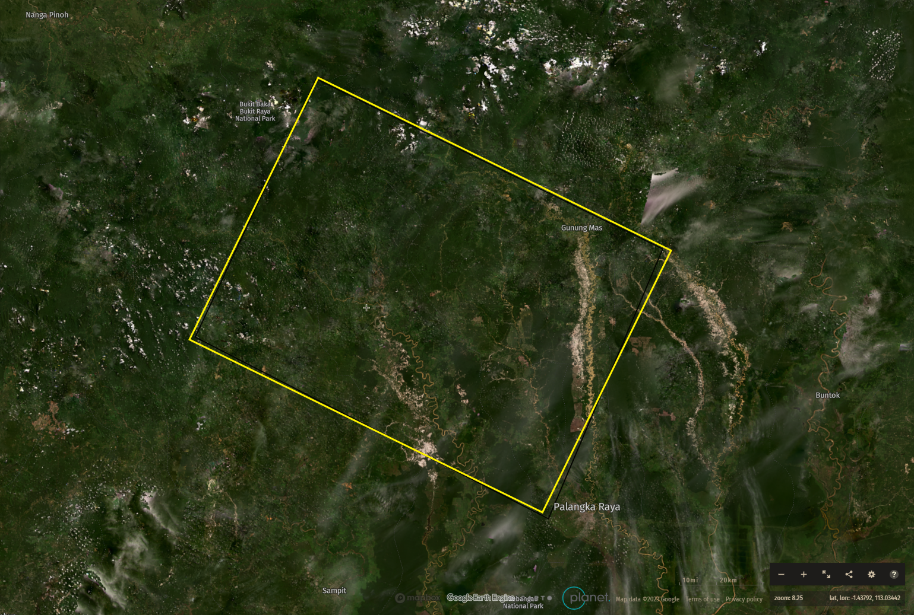
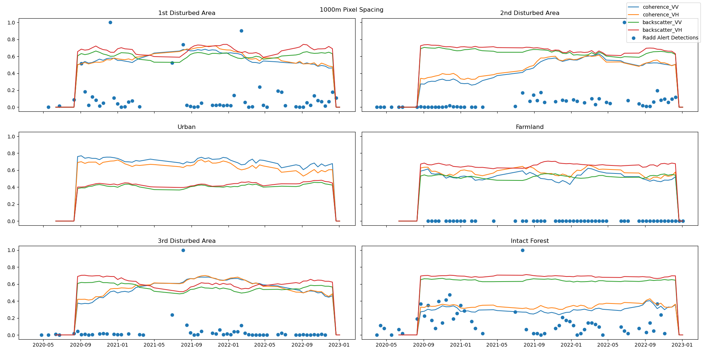

# Sentinel-1-Coherence-Pipeline
MSc Sentinel-1 Coherence Processing &amp; Analysis pipeline, using Snappy, Rasterio &amp; Xarray.

<!-- ABOUT THE PROJECT -->
## About The Project
<!-- 
Coherence remains an underdeveloped InSAR product when it comes to forest monitoring applications.
Plenty of examples of the use of backscatter in production can be found, see the Global Forest Watch initiative.  
However, there lacks an implementation of coherence in these already existing backscatter monitoring systems.
Coherence can be an affective supplimental data source for backscatter based systems. 

Here, I present a pipeline for processing Sentinel-1 SLC data to produce Xarray data-cubes containing both coherence and 
backscatter time series. 
-->

### Contents:
Thesis Proposal,\
Interface to Sentinel-1 preprocessing through SNAPPY,\
Coherence and backscatter processing from SLC & ASF SBAS Pairs,\
Functions for Xarray data-cube production, combining polarisations and varying window sizes,\
Coherence change detection based on Mintpy: https://github.com/insarlab/MintPy-tutorial/blob/main/applications/coherence_change_detection.ipynb

### Utility:
Produce animation of tiff stack.\
calculate coherence change over time and plot coherence change detection.\

### Pipeline creation:
Pipeline creation with Snappy. 

Methods:

## Introduction:
# Study Area:

The study area comprises of a number of SAR acquisition tiles over the Central
Kalimantan region of Indonesia on the island of Borneo, known for its intensive
logging activities. Using the Global Forest Watch platform this area was selected as
it exhibits clear-cut forested areas, detected by the RADD layer of the integrated
deforestation alert system. Particular interest is given to a number of events that
occured between February 2021 and March 2022.

  
  

example acquisition over Borneo.

# Methods

Above, I have introduced several python scripts containing functions for SLC processing.
the file Sentinel_1_SLC_Preprocessing.py contians Java-Script operators which link into the python interface for the ESA's Sentinels Application Platform(SNAP) through the python package SNAPPY.
Here, I created a backend interface for preprocessing backscatter and coherence images given: a folder containing SLCs, a CSV file containing coherence pairs(downloaded from ASF Vertex).
The front end of this process is contained within the file Backscatter_Preprocessing.py. Within this file, parameters such as window size, swath and burst selection, speckle filter and preprocessing mode are selected. This front end is as short as possible to promote easy alteration when producing coherence or backscatter results.

### Analysis:

## Research Question 1: 
# Building a Scalable Coherence Pipeline:

  

    
    
  

Example 12-day InSAR coherence acquisitions, for 20210501_20210513 and 20210724_20210805 repectively. Regular coherence and backscatter aquisitions over three years are stacked into rasterio stacks before being combined into Xarray data-cubes for final analysis. 

  

Example coherence polygons over region.

All figures below represent a percentage of the highest value for the time-period.

  

Perpendicular distances between acquisitions and precipitation over subject area. 
Precipitation is averaged over the number of days between coherence acquisitions.

The concept of coherence is central to this thesis, so it's determination was thoroughly researched. 
Coherence is determined by a spatial averaging window, where the true coherence is determined over a sum of infinite looks. 
In reality this is not possible, so the estimation of coherence contains bias from a number of sources. This bias decreases with increasing number of looks.   

$$γ̃ = γ e^{iΔφ} = \frac{\sum\limits_{N}E(S_1S_2^*)}{\sqrt{\sum\limits_{N}E(|S_1|^2)\sum\limits_{N}E(|S_2|^2)}}$$

As you increase th window size sued to calculate coherence, you decrease the bias associated with calculating it. This comes from the following equation: 

$$`γ̃  = γ_{snr}\tilde{\gamma}_{sys}\tilde{\gamma}_{sp}\tilde{\gamma}_{temp}`$$

  

    
      
    
  

Coherence estimates decrease as the window size increases. This affect is introduced due to the ratio of the bias to the coherence signal.  

## Research Question 2:
# Coherence Time-Series Analysis:

For my analysis,. show the time series of the change in coherence anmd backscattter, and talk about my results so far with them..
I also want to add the original coherence and bsc values possibly on top of the results? I feel like this will be too much information for the README... Posbbly for the readme I just stick to the boxcar plots.

In the plots above, we can see 3 confirmed forest disturbance events, with three reference areas with more consistent coherence and backscatter. 

These plots clearly show the decrease of backscatter and a significant increase in coherence when a large disturbance event occurs. 
The number of RADD-Alert Events is defined as the ratio between the number of events of the current day and the maximum number of events of any observed day.
Some notable events include:
Clear detection of disturbance events in the 3 disturbed areas,
higher sensitivity of coherence vs backscatter, (particularly observed in the 2nd disturbance event, where coherence rises from 25% to ~ 60% of its maximum value)
Consistent signals for both Urban and Intact Forest, showing that both coherence and backscatter are stable for the observations,
while farmland has a change in backscatter, presumably due to to reaping of the harvest, no forest disturbance events are detected.

To-Do:
some "simple" modelling...
