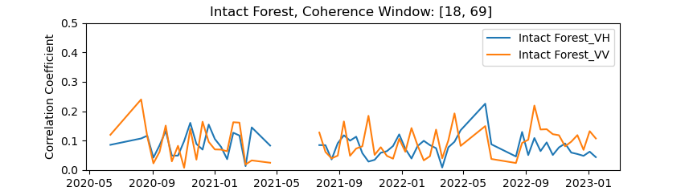
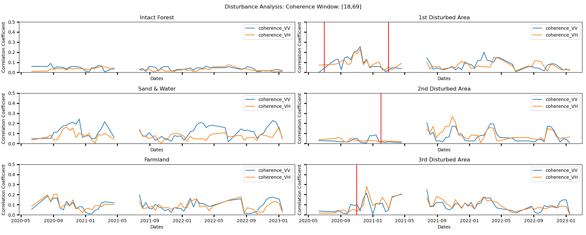
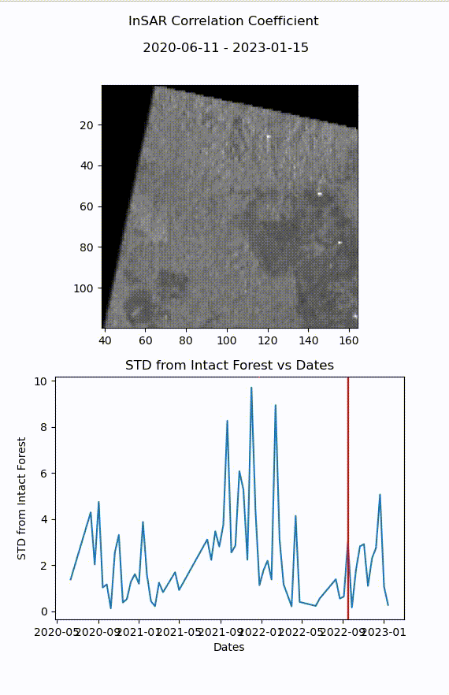

# Assessing Sentinel-1 Coherence Measures for Tropical Forest Disturbance Mapping
## Sentinel-1-Coherence-Pipeline

MSc Sentinel-1 Coherence Processing &amp; Analysis pipeline, using Snappy, Rasterio &amp; Xarray.

  

<!-- ABOUT THE PROJECT -->
## About The Project
<!-- 
Coherence remains an underdeveloped InSAR product when it comes to forest monitoring applications.
Plenty of examples of the use of backscatter in production can be found, see the Global Forest Watch initiative.  
However, there lacks an implementation of coherence in these already existing backscatter monitoring systems.
Coherence can be an affective supplimental data source for backscatter based systems. 

Here, I present a pipeline for processing Sentinel-1 SLC data to produce Xarray data-cubes containing both coherence and 
backscatter time series. 
-->

## Contents

#### Thesis Proposal: 
Original proposal for this thesis, which outlines the goals, objectives, and methodology of the research.

##### SNAPPY_interface: 
Python module contained in src/sentinel1slc.py that provides functions that interface to the Sentinel-1 preprocessing tools provided by the SNAP software.  uses the SNAPPY interface to perform preprocessing.  

#### Coherence_and_backscatter_processing: 
bin/seninel1slc_bsc_coh_preprocessing.py contains a script for processing SLC and ASF SBAS pairs to generate coherence and backscatter data. 

#### Xarray_data_cube_production: 
src/coherence_time_series.py contains a Python class that provides functionality for combining polarisations and varying window sizes to generate Xarray data cubes from the coherence and backscatter data generated in the previous step. This class includes a range of methods for manipulating and visualising the data.

#### Data_analysis: 
The bin/coherence_time_series_analysis.py script provides interface examples to the CoherenceTimeSeries class used
to performs data analysis and to generate final data products.

#### Utils: 
This directory contains works in progress and a range of utility functions. These include functions for animating a coherence stack, calculating coherence change and coherence change detection.  

## Introduction:
# Study Area:

This study focuses on the Central Kalimantan region of Indonesia on the island of Borneo, which is known for its extensive logging activities. The study area consists of a number of SAR acquisition tiles and was selected using the Global Forest Watch platform due to its clear-cut forested areas, which were detected by the RADD layer of the integrated deforestation alert system. The study examines specific events that occurred between February 2021 and March 2022, which are of particular interest.

  
  

example acquisition over Borneo.

# Methods

The methodology of this study consists of three main steps. Firstly, SAR images were pre-processed using the Sentinel-1 Toolbox and Python packages such as Snappy. The pre-processing involved steps such as co-registration, calibration and  terrain correction. Secondly, coherence images were generated from the pre-processed SAR images using the SNAP software. Finally, coherence time series were analyzed using custom Python scripts and packages such as Rasterio and Xarray. The analysis involves identifying areas of change and assessing the suitability of coherence measures for mapping forest disturbances in the study area.

### Analysis:

## Research Question 1: 
# Building a Scalable Coherence Pipeline:

The determination of coherence is a crucial step in the analysis of synthetic aperture radar (SAR) data for mapping forest disturbances. Coherence is a statistical measure that reflects the degree of similarity between two SAR images acquired over the same area at different times. The coherence value ranges between 0 and 1, with a higher coherence indicating a higher correlation between the two images.

The calculation of coherence involves taking the complex conjugate of one image and multiplying it by the other image. This product is then averaged over a spatial averaging window to obtain the estimated coherence value. The size of the averaging window plays a crucial role in the estimation of coherence. A smaller window size provides higher spatial resolution but also results in higher noise levels and lower coherence values. On the other hand, a larger window size results in lower noise levels but lower spatial resolution.

The estimation of coherence can be represented by the equation:

$$γ̃ = γ e^{iΔφ} = \frac{\sum\limits_{N}E(S_1S_2^*)}{\sqrt{\sum\limits_{N}E(|S_1|^2)\sum\limits_{N}E(|S_2|^2)}}$$

where $\gamma$ is the true coherence, $e^{iΔφ}$ is the phase difference between the two complex SAR images $S_1$ and $S_2$, and $E(.)$ represents the statistical expectation operator.

In practice, the true coherence cannot be obtained over an infinite number of looks due to the limitations of the SAR system. Therefore, the estimation of coherence is subject to bias from a number of sources, such as speckle noise, atmospheric conditions, and terrain variations. The magnitude of this bias decreases with an increasing number of looks used in the calculation, and a trade-off exists between the number of looks and the spatial resolution of the resulting coherence image.

$$`γ̃  = γ_{snr}\tilde{\gamma}_{sys}\tilde{\gamma}_{sp}\tilde{\gamma}_{temp}`$$

To obtain accurate and reliable coherence values for mapping forest disturbances, it is essential to optimize the processing parameters, including the spatial averaging window size and the number of looks used in the calculation. Furthermore, it is important to consider the environmental factors that may affect coherence, such as precipitation and changes in vegetation structure. By carefully selecting the processing parameters and accounting for environmental factors, the coherence values can be maximized, resulting in more accurate and precise mapping of forest disturbances.

Shown below are three coherence images obtained using different spatial averaging window sizes and pixel spacings. The images were generated using [2,8], [9,34], and [18,69] window sizes, respectively. As the window size increases, the resulting coherence estimate approaches the true coherence value obtained using infinite looks. The images visually demonstrate the impact of window size on coherence estimates and the importance of selecting an appropriate window size for a given application.

  

    
    
    
  

  

    
      
    
  

## Research Question 2: 
# Temporal Analysis of Disturbance Events:

Bones:

The Affect of Precipitation in the two plots is overshadowed by the affect of the perpendicular baseline on the coherence estimations.
From a visual inspecition one can see the how the value of coherence is strongly correlated with the perpendicular baseline or distance between two coherence pairs. 

  

  

This area of intact forest is the reference area for this study.

  

We see disturbed forest areas in the three subplots on the right. Given the alarge coherence estimation windows used, we can see the clear difference between the intact forest and the disturbed forest areas.

  

We can see below a visualisation of an affected area. Given the high coherence estimations the sensitivity of the system is clearly sufficient to detect changes in coherence at the 3 sigma level of significance. In fact, we see quite few iamges where a disturbance does not occur.

In our Farmland section, we can clearly see the periods of harvesting in Indonesia. These last from April-May and October-November.

The sensitivity of the detection leads us to have the capacity to make use of the high resolution coherence data available. This still shows accurate events occuring. (I need to figure out a baseline of comparison for these event detections. I guess that my sand and water could be a basis?)

  

